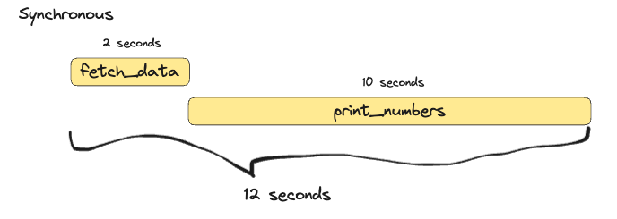
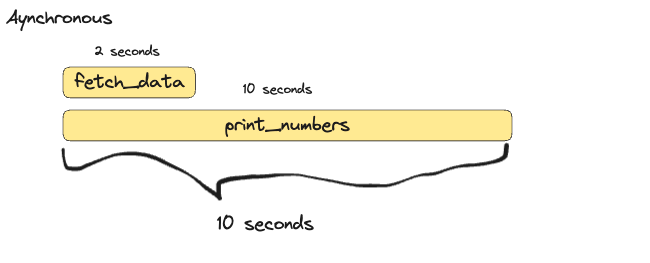

# Python Async Guide

## What is this repository?

- For me, the concept of python asyncio is difficult.
- To understand it, organize the info.

## What is Asynchrounous Programing?

- allows a program to perform multiple operations concurrently.
- While main tasks run, other tasks are initiated and then are set aside until results are needed
- For example, when you wait for the oven to bake a cake, you are free. So during baking you can cook whip.

## Synchronous vs Asynchronous

- Synchronous

  - The code will be run from up to down.
  - Let't consider the example: `sync_vs_async/sync.py`

    - In the code, there are 2 tasks, the one is `fetch_data` and the other is `print_numbers`
    - On synchronous programming after `fetch_data` is done, `print_numbers` starts and it totally takes 12 seconds to finish the code.
    - try the below command,

    > python sync_vs_async/sync.py

    ```bash
    Start fetching
    Done fetching
    {'data': 1}
    0
    1
    2
    3
    4
    5
    6
    7
    8
    9
    ```

    

- Asynchronous

  - Asynchronous programming works differently.
  - Let't consider the example: `sync_vs_async/async.py`

    - Now, each functions have a keyword `async` before `def`.
    - In main function, `fetch_data` and `print_numbers` are created as tasks.
    - The tasks are defined but these are not yet executed at this point. When the first `await` appears, these tasks will be run.
    - try the below command,

    > python sync_vs_async/async.py

    ```
    tasks1 and 2 created, but not yet executed
    Start fetching
    0
    1
    Done fetching
    2
    3
    4
    5
    6
    7
    8
    9
    {'data': 1}
    ```

    - You can see this code run tasks concurrently like the below diagram.

    
